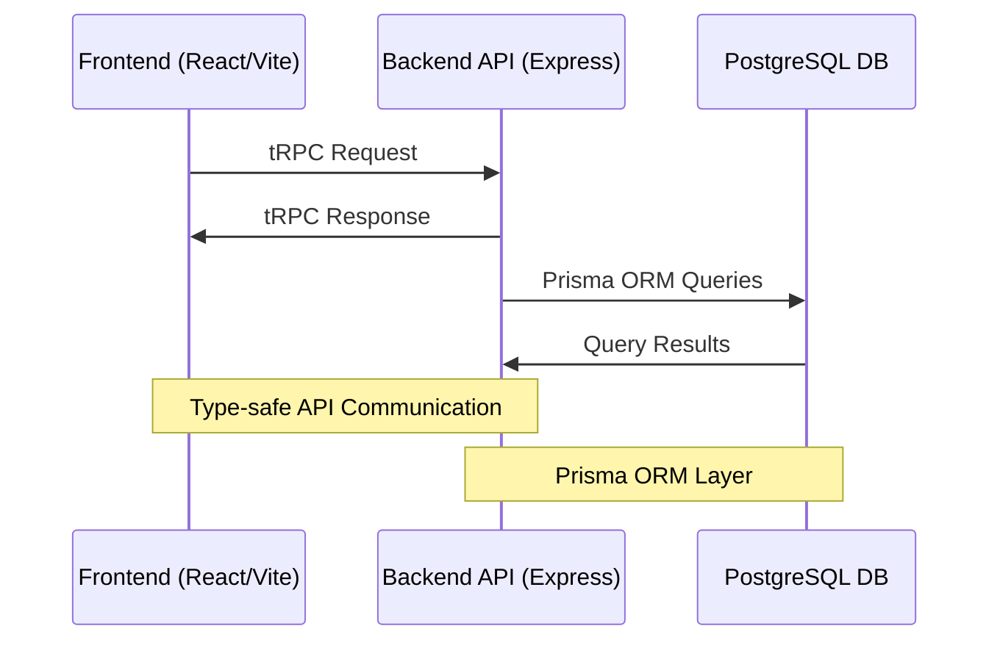

# Deforum - Verified Community Platform

## Overview

Deforum is a community platform (similar to Reddit) with a unique verification system that allows communities to require verified credentials (badges) from their members. This creates trusted spaces where membership is based on verifiable attributes rather than just user registration.

## Core Features

### Badge System
- **Badge Types**: Badges represent verified credentials (e.g., email ownership, age verification)
- **Privacy Control**: 
  - Badges can be marked as private or public by default (`privateByDefault` setting)
  - Users can override the visibility of their individual badges
  - Private badges are only visible to community moderators when required
- **Expiration**:
  - Badges can have an optional expiration period (`expiresAfter` in days)
  - When issued, `expiresAt` is automatically calculated
  - Expired badges require re-verification
  - Examples:
    - Company email badges expire after 1 year
    - Country verification badges expire after 5 years
    - Age verification badges never expire

### Posts and Discussions
- **Anonymous Posting**:
  - Users can choose to post anonymously (`isAnon: true`)
  - Anonymous posts maintain accountability through private nullifier proofs
  - Original poster can prove ownership while maintaining privacy
- **Replies**:
  - Support for threaded discussions
  - Can be anonymous like posts
  - Maintain parent-child relationships for nested conversations
- **Reactions**:
  - Emoji-based reaction system
  - Uses nullifier proofs to prevent duplicate reactions
  - Tracks reaction counts while preserving privacy
  - Format: `{ "emoji": { "count": number, "nullifiers": string[] } }`

### Communities
- **Access Control**:
  - Communities can require specific badges for membership
  - Badge requirements can be public or private
  - Support for domain-specific requirements (e.g., @company.com emails)
  - Private invite lists through email verification
- **Membership**:
  - Members must maintain valid badges
  - Expired badges may revoke access
  - Support for different roles (member, moderator, admin)

## Architecture



### System Components

#### Frontend (React Application)
- React application using Vite
- Type-safe API communication with tRPC
- Real-time updates and caching with TanStack Query

#### Backend API (Node.js/Express)
- TypeScript-based Express application
- tRPC for type-safe API endpoints
- Prisma ORM for database schema and migrations

#### Database (PostgreSQL)
- PostgreSQL 15

## Tech Stack

### Frontend
- **Framework**: React
- **Routing**: Tanstack Router
- **Build Tool**: Vite
- **Language**: TypeScript
- **State Management**: React Context + TanStack Query
- **UI Components**: Tailwind
- **API Integration**: tRPC

### Backend
- **Runtime**: Node.js
- **Framework**: Express
- **Language**: TypeScript
- **ORM**: Prisma
- **API Layer**: tRPC
- **Type Safety**: End-to-end TypeScript

### Database
- **Engine**: PostgreSQL 15
- **Migration Tools**: Custom SQL + Prisma
- **Backup Strategy**: [TBD]

### Development Tools
- **Package Manager**: Yarn
- **Monorepo Tool**: Turborepo
- **Containerization**: Docker
- **Container Orchestration**: Docker Compose
- **Version Control**: Git
- **CI/CD**: [TBD]

### Shared Resources
- **Types**: Shared TypeScript definitions
- **Utils**: Common utility functions
- **Constants**: Shared configuration
- **Schemas**: Shared validation schemas

## Core Concepts

### Protocols
- **Definition**: A protocol is a method of verifying a specific attribute or credential (a badge)
- **Purpose**: Protocols define HOW something is verified
- **Examples**:
  - Google Sign-in (verifies email ownership)
  - Magic Link Email verification
  - Passport verification (verifies age, nationality)
  - Driver's License verification
  - Company email verification
- **Properties**:
  - Each protocol can issue multiple types of badges
  - Multiple protocols can issue the same type of badge
  - Protocols can be active or inactive

### Badges
- **Definition**: A badge is a verified credential that a user has earned
- **Purpose**: Badges represent WHAT has been verified
- **Examples**:
  - Verified Email Badge
  - Age 18+ Badge
  - Age 21+ Badge
  - Country Residence Badge
- **Properties**:
  - Issued by protocols
  - Can be public or private
  - Have metadata about the verification
  - Can expire and need re-verification
  - Same badge type can be issued by different protocols

### Communities
- **Definition**: Discussion spaces that require specific verified credentials to join
- **Purpose**: Create trusted spaces with verified members
- **Types**:
  - Public communities (requirements visible to all)
  - Private communities (some requirements may be hidden)
- **Badge Requirements**:
  - Can require multiple badges
  - Can specify detailed requirements for badges:
    - Email domain requirements (e.g., must be @company.com)
    - Specific email lists (private invite lists)
    - Age thresholds
    - Other badge-specific criteria
  - Requirements can be public or private

## Data Model

### Users
- Basic profile information
- Collection of earned badges
- Community memberships
- Posts and replies
- Can choose which badges are publicly visible

### Protocols
- Name and description
- Active/inactive status
- List of badge types they can issue
- Verification method details

### Badges
- Name and description
- Metadata schema for the credential
- Which protocols can issue it
- Verification requirements

### User Badges
- Links user to a badge
- Stores verification metadata
- Tracks verification date
- Tracks expiration
- Public/private visibility setting
- Which protocol issued it

### Communities
- Basic community information
- Required badges for membership
- Badge requirement specifications
  ```json
  {
    "type": "domain",
    "domains": ["company.com"],
    "subdomains": true,
    "isPublic": true
  }
  // or
  {
    "type": "emails",
    "emails": ["user@domain.com"],
    "isPublic": false
  }
  ```
- Public/private setting

### Posts & Replies
- Standard forum functionality
- Linked to communities
- Can be anonymous or attributed
- Reaction system

## Technical Implementation

### Database Schema
The application uses Prisma as its ORM with PostgreSQL. Key models include:
- User
- Protocol
- Badge
- UserBadge
- Community
- CommunityRequiredBadge
- Post
- PostReply

### API Structure
- Type-safe API design using tRPC with separate routers for:
  - User management
  - Protocol verification
  - Badge management
  - Community management
  - Posts and replies

### Verification Flow
1. User initiates verification through a protocol
2. Protocol verifies the claimed attribute
3. Badge is issued with:
   - Privacy setting (from badge default)
   - Expiration (if badge type has `expiresAfter`)
   - Verification metadata
4. Regular re-verification for expired badges

### Anonymous Posting System
1. User creates post/reply with `isAnon: true`
2. System generates:
   - Nullifier proof for accountability
   - Anonymous metadata for verification
3. Original poster can prove ownership using:
   - Nullifier
   - Public signals
   - Zero-knowledge proof

### Reaction System
1. User adds/removes reaction with:
   - Post ID
   - Emoji type
   - Nullifier (for uniqueness)
   - Add/remove flag
2. System updates reaction count
3. Stores nullifiers to prevent duplicates

### Community Access Control
1. Community defines badge requirements:
   ```json
   {
     "type": "domain",
     "domains": ["company.com"],
     "subdomains": true,
     "isPublic": true
   }
   // or
   {
     "type": "emails",
     "emails": ["user@domain.com"],
     "isPublic": false
   }
   ```
2. System checks:
   - Required badges
   - Badge validity
   - Expiration status
   - Domain/email requirements

## Security Considerations

### Privacy
- Private badges visible only when required
- Anonymous posting with accountability
- Reaction privacy through nullifiers
- Community requirement privacy options

### Verification
- Regular badge re-verification
- Expiration enforcement
- Protocol-specific verification methods
- Secure metadata storage

### Access Control
- Fine-grained permission system
- Badge requirement validation
- Expiration checking
- Role-based access control

## Future Considerations

### Planned Features
- Advanced badge delegation
- More verification protocols
- Enhanced privacy features
- Granular permission system

### Extensibility
- Pluggable protocol system
- Flexible badge metadata
- API-first design
- Custom requirement types

## Development Guidelines

### Code Organization
- Modular architecture
- Clear separation of concerns
- Type safety with TypeScript
- Comprehensive test coverage

### Best Practices
- Use transactions for related operations
- Validate all user input
- Handle edge cases gracefully
- Document all API endpoints
- Follow security best practices

This specification serves as a living document and should be updated as the system evolves. 