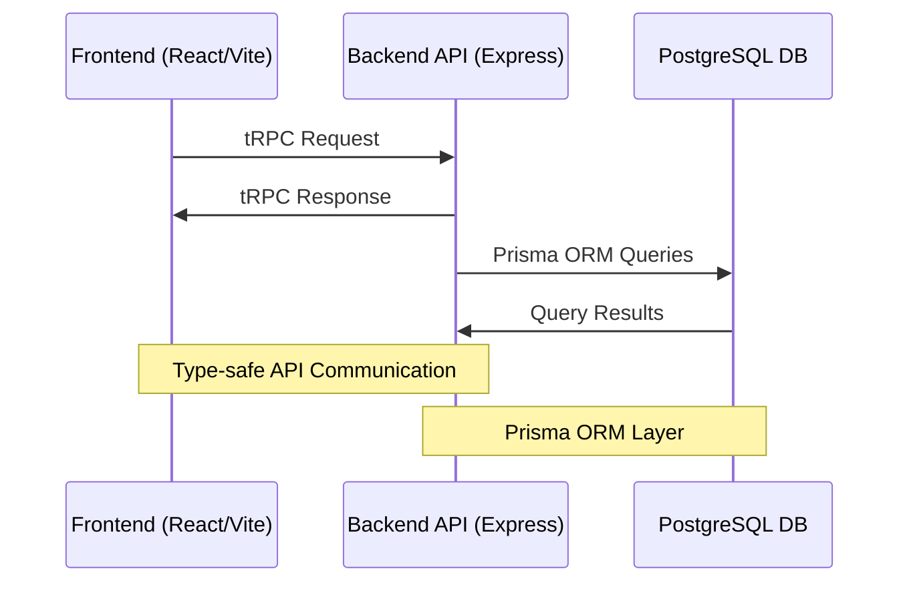

# Deforum - Verified Community Platform

## Overview

Deforum is a community platform (similar to Reddit) with a unique verification system that allows communities to require verified credentials (badges) from their members. This creates trusted spaces where membership is based on verifiable attributes rather than just user registration.

## Core Features

### Badge System
- **Badge Types**: Badges represent verified credentials (e.g., email ownership, age verification)
- **Privacy Control**: 
  - Badges can be marked as private or public by default (`privateByDefault` setting)
  - Users can override the visibility of their individual badges
  - Private badges are only visible to community moderators when required
- **Expiration**:
  - Badges can have an optional expiration period (`expiresAfter` in days)
  - When issued, `expiresAt` is automatically calculated
  - Expired badges require re-verification
  - Examples:
    - Company email badges expire after 1 year
    - Country verification badges expire after 5 years
    - Age verification badges never expire

### Badge Definitions
Badge definitions represent the types of badges that can be issued to users. Each badge definition:
- Has a unique name and slug
- Can be associated with multiple protocols
- Can have custom metadata
- Can be set as private by default
- Can have an expiration period

The relationship between protocols and badge definitions is many-to-many, meaning:
- A protocol can be used to create multiple types of badges
- A badge definition can use multiple protocols for verification
- Each protocol-badge relationship can have its own metadata

### Badge Credentials
Badge credentials are instances of badges issued to users. Each credential:
- Links a user to a badge definition
- Has a verification timestamp
- Can be public or private
- Can have custom metadata
- Can have an expiration date
- Can be revoked

### Posts and Discussions
- **Anonymous Posting**:
  - Users can choose to post anonymously (`isAnon: true`)
  - Anonymous posts maintain accountability through private nullifier proofs
  - Original poster can prove ownership while maintaining privacy
- **Replies**:
  - Support for threaded discussions
  - Can be anonymous like posts
  - Maintain parent-child relationships for nested conversations
- **Reactions**:
  - Emoji-based reaction system
  - Uses nullifier proofs to prevent duplicate reactions
  - Tracks reaction counts while preserving privacy
  - Format: `{ "emoji": { "count": number, "nullifiers": string[] } }`

### Communities
- **Access Control**:
  - Communities can require specific badges for membership
  - Badge requirements can be public or private
  - Support for domain-specific requirements (e.g., @company.com emails)
  - Private invite lists through email verification
- **Membership**:
  - Members must maintain valid badges
  - Expired badges may revoke access
  - Support for different roles (member, moderator, admin)

## Architecture



### System Components

#### Frontend (React Application)
- React application using Vite
- Type-safe API communication with tRPC
- Real-time updates and caching with TanStack Query

#### Backend API (Node.js/Express)
- TypeScript-based Express application
- tRPC for type-safe API endpoints
- Prisma ORM for database schema and migrations

#### Database (PostgreSQL)
- PostgreSQL 15

## Tech Stack

### Frontend
- **Framework**: React
- **Routing**: Tanstack Router
- **Build Tool**: Vite
- **Language**: TypeScript
- **State Management**: React Context + TanStack Query
- **UI Components**: Tailwind
- **API Integration**: tRPC

### Backend
- **Runtime**: Node.js
- **Framework**: Express
- **Language**: TypeScript
- **ORM**: Prisma
- **API Layer**: tRPC
- **Type Safety**: End-to-end TypeScript

### Database
- **Engine**: PostgreSQL 15
- **Migration Tools**: Custom SQL + Prisma
- **Backup Strategy**: [TBD]

### Development Tools
- **Package Manager**: Yarn
- **Monorepo Tool**: Turborepo
- **Containerization**: Docker
- **Container Orchestration**: Docker Compose
- **Version Control**: Git
- **CI/CD**: [TBD]

### Shared Resources
- **Types**: Shared TypeScript definitions
- **Utils**: Common utility functions
- **Constants**: Shared configuration
- **Schemas**: Shared validation schemas

## Core Concepts

### Protocols
- **Definition**: A protocol is a method of verifying a specific attribute or credential (a badge)
- **Purpose**: Protocols define HOW something is verified
- **Examples**:
  - Google Sign-in (verifies email ownership)
  - Magic Link Email verification
  - Passport verification (verifies age, nationality)
  - Driver's License verification
  - Company email verification
- **Properties**:
  - Each protocol can issue multiple types of badges
  - Multiple protocols can issue the same type of badge
  - Protocols can be active or inactive

### Badges
- **Definition**: A badge is a verified credential that a user has earned
- **Purpose**: Badges represent WHAT has been verified
- **Examples**:
  - Verified Email Badge
  - Age 18+ Badge
  - Age 21+ Badge
  - Country Residence Badge
- **Properties**:
  - Issued by protocols
  - Can be public or private
  - Have metadata about the verification
  - Can expire and need re-verification
  - Same badge type can be issued by different protocols

### Communities
- **Definition**: Discussion spaces that require specific verified credentials to join
- **Purpose**: Create trusted spaces with verified members
- **Types**:
  - Public communities (requirements visible to all)
  - Private communities (some requirements may be hidden)
- **Badge Requirements**:
  - Can require multiple badges
  - Can specify detailed requirements for badges:
    - Email domain requirements (e.g., must be @company.com)
    - Specific email lists (private invite lists)
    - Age thresholds
    - Other badge-specific criteria
  - Requirements can be public or private

## Data Model

### Users
- Basic profile information
- Collection of earned badges
- Community memberships
- Posts and replies
- Can choose which badges are publicly visible

### Protocols
- Name and description
- Active/inactive status
- List of badge types they can issue
- Verification method details

### Badges
- Name and description
- Metadata schema for the credential
- Which protocols can issue it
- Verification requirements

### User Badges
- Links user to a badge
- Stores verification metadata
- Tracks verification date
- Tracks expiration
- Public/private visibility setting
- Which protocol issued it

### Communities
- Basic community information
- Required badges for membership
- Badge requirement specifications
  ```json
  {
    "type": "domain",
    "domains": ["company.com"],
    "subdomains": true,
    "isPublic": true
  }
  // or
  {
    "type": "emails",
    "emails": ["user@domain.com"],
    "isPublic": false
  }
  ```
- Public/private setting

### Posts & Replies
- Standard forum functionality
- Linked to communities
- Can be anonymous or attributed
- Reaction system

## Technical Implementation

### Database Schema
The application uses Prisma as its ORM with PostgreSQL. Key models include:

#### Core Models
- **User**
  - Basic profile information (username, email, avatar, bio)
  - Privacy settings (showFollowers, showFollowing)
  - Following relationships
  - Public key management
  - Badge credentials

- **Protocol**
  - Name and description
  - Active/inactive status
  - Slug for routing
  - Associated badge definitions

- **BadgeDefinition**
  - Name and description
  - Protocol association
  - Privacy default setting
  - Expiration configuration
  - Metadata schema

- **BadgeCredential**
  - Links user to badge definition
  - Verification metadata
  - Issuance and expiration tracking
  - Public/private visibility
  - Protocol reference

#### Community & Membership
- **Community**
  - Basic information
  - Privacy settings
  - Badge requirements
  - Member management
  - Merkle root history

- **CommunityMember**
  - User-community relationship
  - Role (ADMIN/MEMBER)
  - Join timestamp

- **CommunityRequiredBadge**
  - Badge requirement specification
  - Requirement metadata (domains, emails)
  - Public/private visibility

- **CommunityMerkleRoot**
  - Historical merkle roots for community
  - Timestamp tracking
  - Used for anonymous action verification
  - Links to proof metadata

#### Content & Interactions
- **Post**
  - Title and content
  - Author reference
  - Community association (optional)
  - Anonymous posting support
  - Signature/proof metadata
  - View tracking
  - Reaction collection

- **PostReply**
  - Content and threading
  - Parent-child relationships
  - Anonymous reply support
  - Signature/proof metadata
  - Reaction collection

- **Reaction**
  - Emoji-based reactions
  - Proof metadata for anonymous reactions
  - Post/reply association

#### Identity & Privacy
- **UserPublicKey**
  - Public key storage
  - Activation status
  - Creation/deactivation timestamps
  - Used for post/reply signatures

- **SemaphoreProofMetadata**
  - Proof verification data
  - Nullifier tracking
  - Public signals
  - Merkle root association
  - Creation timestamp

- **Follow**
  - User following relationships
  - Timestamp tracking
  - Bidirectional querying support

### Key Management System

The platform implements a robust key management system:

1. **Key Generation**
   - Keys are generated on client devices
   - Private keys never leave the device unencrypted
   - Public keys are registered with the server

2. **Multi-Device Support**
   - Private keys can be encrypted with device-specific symmetric keys
   - Encrypted private keys can be stored server-side
   - New devices can fetch and decrypt keys

3. **Key Rotation**
   - Users can rotate keys if compromised
   - Badge re-verification required for rotation
   - Historical keys marked as deactivated
   - Signatures remain valid but no new signatures

### Anonymous Actions System

The platform uses a Semaphore-based anonymous action system:

1. **Merkle Tree Management**
   - Each community maintains its own merkle tree
   - Trees are updated when membership changes
   - Historical roots are preserved with timestamps
   - 5-minute validity window for proofs

2. **Proof Requirements**
   - All anonymous actions require valid proofs
   - Proofs must reference recent merkle roots
   - Nullifiers prevent duplicate actions
   - Public signals contain merkle root

3. **Supported Actions**
   - Anonymous posting
   - Anonymous replies
   - Anonymous reactions
   - All tied to community membership

### Reaction System

The reaction system implements privacy-preserving emoji reactions:

1. **Structure**
   - Individual reaction records
   - Emoji type
   - Optional proof metadata
   - Post/reply association

2. **Privacy Features**
   - Anonymous reactions supported
   - Nullifier-based duplication prevention
   - Community membership verification
   - Proof validation

## Security Considerations

### Privacy
- Private badges visible only when required
- Anonymous posting with accountability
- Reaction privacy through nullifiers
- Community requirement privacy options

### Verification
- Regular badge re-verification
- Expiration enforcement
- Protocol-specific verification methods
- Secure metadata storage

### Access Control
- Fine-grained permission system
- Badge requirement validation
- Expiration checking
- Role-based access control

## Future Considerations

### Planned Features
- Advanced badge delegation
- More verification protocols
- Enhanced privacy features
- Granular permission system

### Extensibility
- Pluggable protocol system
- Flexible badge metadata
- API-first design
- Custom requirement types

## Development Guidelines

### Code Organization
- Modular architecture
- Clear separation of concerns
- Type safety with TypeScript
- Comprehensive test coverage

### Best Practices
- Use transactions for related operations
- Validate all user input
- Handle edge cases gracefully
- Document all API endpoints
- Follow security best practices

This specification serves as a living document and should be updated as the system evolves.

## Protocol System

### Protocols
Protocols are verification methods that can be used to verify badges. Each protocol:
- Has a unique name and slug
- Can be used to verify multiple badge types
- Has an active/inactive status
- Can have custom metadata

### Protocol-Badge Relationship
The relationship between protocols and badge definitions is many-to-many:
- A protocol can be used to verify multiple badge types
- A badge definition can be verified using multiple protocols
- Each protocol-badge relationship can have its own metadata
- This allows for flexible verification strategies where a badge can be obtained through different protocols
- The relationship is managed through the `protocol_badge_definitions` join table

For example:
```json
{
  "badge": {
    "name": "Age Verification",
    "protocols": [
      {
        "protocol": "passport-verification",
        "metadata": {
          "minAge": 21,
          "acceptedCountries": ["US", "CA", "EU"]
        }
      },
      {
        "protocol": "drivers-license",
        "metadata": {
          "minAge": 21,
          "acceptedStates": ["CA", "NY", "TX"]
        }
      }
    ]
  }
}
```

### Badge Definitions
Badge definitions represent the types of badges that can be issued to users. Each badge definition:
- Has a unique name and slug
- Can be associated with multiple protocols
- Can have custom metadata
- Can be set as private by default
- Can have an expiration period

### Badge Credentials
Badge credentials are instances of badges issued to users. Each credential:
- Links a user to a badge definition
- Has a verification timestamp
- Can be public or private
- Can have custom metadata
- Can have an expiration date
- Can be revoked
- Tracks which protocol was used for verification

### Verification Process
1. User selects a badge type to verify
2. User chooses one or more protocols to use for verification
3. Each protocol performs its verification process
4. Upon successful verification:
   - A badge credential is issued
   - Protocol-specific metadata is stored
   - Expiration is set if applicable
   - Privacy settings are applied

### Privacy Considerations
- Badge definitions can be set as private by default
- Users can override privacy settings for individual badges
- Protocol-specific metadata can be selectively shared
- Verification proofs can be generated without revealing raw data

### Implementation Details
- Uses a join table `protocol_badge_definitions` for many-to-many relationships
- Stores protocol-specific metadata in the join table
- Maintains proper indexing for efficient queries
- Handles cascading deletes appropriately
- Supports bulk operations for multiple protocols
 